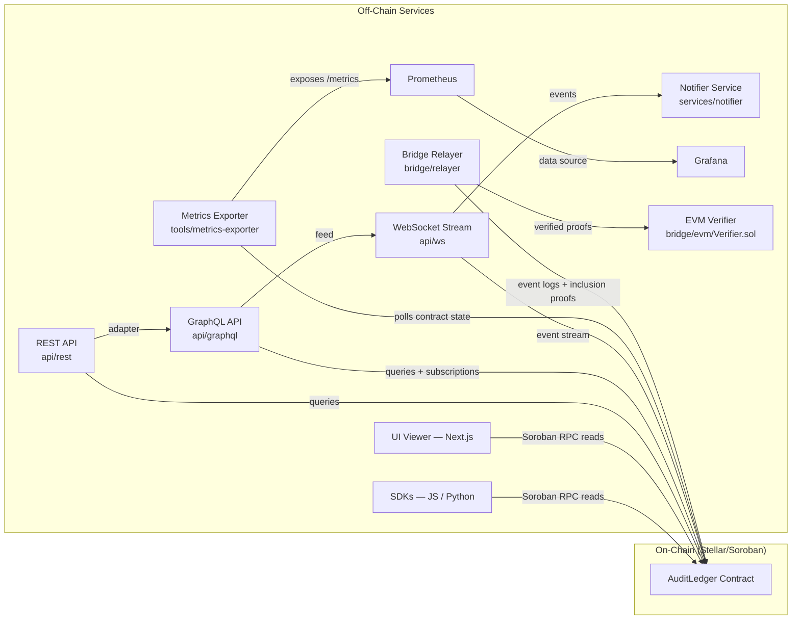

# Architecture Overview

This document explains how the Decentralized Audit & Transparency Ledger is structured — from the on-chain Soroban contract through the off-chain services, APIs, SDKs, monitoring stack, and cross-chain bridge.

For a deeper look at specific design decisions, see [docs/adr/](../adr/).

---

## What the System Does

`AuditLedger` is an append-only event log deployed as a Soroban smart contract on the Stellar network. Any party can submit events (financial transactions, operational records) and any party can verify the full, ordered history — no trusted intermediary required.

Off-chain services build on top of the contract to provide query APIs, real-time event streams, dashboards, alerts, and cross-chain proof verification.

---

## System Diagram



---

## Component Reference

### AuditLedger Contract

**Location:** `src/lib.rs` (root Cargo crate)
**Network:** Stellar / Soroban

The contract is the source of truth. Key design properties:

- **Append-only** — events cannot be modified or deleted once written.
- **Content-addressed** — each event gets a SHA-256 ID derived from its fields plus the contract ID.
- **Hash-chained** — events reference their predecessor, forming a tamper-evident sequence.
- **Cap-gated** — a global max log limit and optional per-event-type caps prevent state bloat.
- **Governance** — an owner address controls caps, TTL, pausing, and ownership transfer.

The contract exposes three groups of functions:

| Group | Functions |
|---|---|
| Write | `initialize`, `log_event`, `log_events` |
| Read | `total_events`, `get_event`, `event_count`, `get_event_by_type` |
| Governance (owner only) | `set_global_max_logs`, `set_event_max_logs`, `remove_event_cap`, `transfer_ownership`, `set_event_ttl`, `get_event_ttl` |

All governance calls emit a Soroban event with topic `("governance", "<function_name>")` so off-chain monitors can track admin activity.

#### Event Structure

```rust
pub struct Event {
    pub index: u32,         // Global sequential index
    pub timestamp: u64,     // Ledger timestamp at log time
    pub event_type: Symbol, // Namespaced event category
    pub submitter: Address, // Address that called log_event
    pub metadata: Bytes,    // Opaque payload (schema defined off-chain)
}
```

#### Storage Model

| Key type | Storage tier | Notes |
|---|---|---|
| Global log registry | `env.storage().instance()` | Sequential array of all events |
| Per-type sub-ledgers | `env.storage().instance()` | Namespaced by `Symbol` |
| TTL events | `env.storage().persistent()` | Written only when `ttl_ledgers > 0`; eligible for network expiry |

---

### SDKs

| SDK | Location | Language |
|---|---|---|
| JavaScript / TypeScript | `sdk/js/` | TypeScript |
| Python | `sdk/python/` | Python |

Both SDKs wrap Soroban RPC calls and provide developer-friendly interfaces for reading and querying the contract. They are suitable for scripts, integrations, and automation tooling.

---

### REST API

**Location:** `api/rest/`
**Default port:** `3002`

A thin HTTP adapter over the contract's read functions. Useful for services or scripts that prefer plain REST access. Routes delegate to the GraphQL resolver layer internally.

---

### GraphQL API

**Location:** `api/graphql/`
**Default port:** `4000`

The central API service. Provides a typed GraphQL schema with:
- Query support for event listing and statistics.
- Subscription support for live event streams.

Client applications that need typed semantics or real-time updates should use this service.

---

### WebSocket Event Stream

**Location:** `api/ws/`
**Default port:** `4000`

A lightweight WebSocket gateway. Clients can subscribe to all events or filter by event type. Used by the Notifier service and can be used directly by custom consumers.

---

### UI — Audit Viewer

**Location:** `ui/`
**Default port:** `3001`
**Framework:** Next.js

A read-only frontend for browsing AuditLedger events and statistics. Reads contract state directly via Soroban RPC using `ui/src/lib/contract.ts`. No backend required for basic usage.

---

### Metrics Exporter

**Location:** `tools/metrics-exporter/`
**Default port:** `8000`

Polls the Soroban contract at a configurable interval (`SCRAPE_INTERVAL_MS`) and exposes Prometheus-compatible metrics on `/metrics`. Used by operators to monitor:
- Total event count
- Per-type event counts
- Contract storage usage

---

### Notifier Service

**Location:** `services/notifier/`

Connects to the WebSocket event stream, matches incoming events against configurable rules, and dispatches alerts via:
- Slack
- Telegram
- Email
- Webhook (generic)

Designed for compliance alerts, audit notifications, and operational alerting.

---

### Cross-Chain Bridge

**Relayer:** `bridge/relayer/`
**EVM verifier:** `bridge/evm/Verifier.sol`
**Bridge health port:** `8080`

The bridge enables independent verification of AuditLedger events on EVM-compatible chains:

1. The relayer polls Stellar for new events and ledger metadata.
2. It constructs an inclusion proof for each event.
3. It submits the proof to `Verifier.sol` on the EVM chain.
4. The verifier validates the proof and marks the event as verified on-chain.

For full proof details and trust model, see [bridge/docs/bridge-architecture.md](../../bridge/docs/bridge-architecture.md).

---

### Monitoring Stack

| Component | Location | Purpose |
|---|---|---|
| Prometheus | `monitoring/prometheus/` | Scrapes metrics from the exporter; stores time-series data |
| Grafana | `monitoring/grafana/` | Dashboards and alerting rules over Prometheus data |
| Alert rules | `monitoring/prometheus/alerts.yml` | Pre-configured alert conditions |

---

## Data Flow

### Event logged → indexed → displayed

```
1. Client calls log_event() on the AuditLedger contract
2. Contract stores the Event struct on-chain and emits a Soroban contract event
3. Off-chain consumers pick up the event:
   ├── UI / SDK  →  direct Soroban RPC reads
   ├── REST API  →  HTTP queries
   ├── GraphQL   →  typed queries and subscriptions
   └── WebSocket →  real-time push to subscribed clients
4. Metrics exporter polls total_events and per-type counts → Prometheus → Grafana
5. Notifier receives events from WebSocket → dispatches alerts
6. Bridge relayer reads event data → builds proof → submits to EVM verifier
```

### Cross-chain verification path

```
Bridge relayer
  ├── Scans Stellar ledger for new AuditLedger events
  ├── Constructs inclusion proof (event + ledger metadata)
  └── Submits proof to Verifier.sol on EVM chain
         └── Verifier validates proof → marks event verified on EVM chain
```

---

## Deployment Topology

### On-chain

- `AuditLedger` contract on a Stellar / Soroban network (testnet or mainnet)
- Optionally `Verifier.sol` on an EVM-compatible chain

### Off-chain (Docker Compose stack)

The `docker-compose.yml` in the repo root starts all off-chain services together:

```
docker compose up --build
```

| Service | Internal port | Exposed port |
|---|---|---|
| ui | 3001 | 3001 |
| rest | 3002 | 3002 |
| metrics-exporter | 8000 | 8000 |
| prometheus | 9090 | 9090 |
| grafana | 3000 | 3000 |
| relayer (bridge health) | 8080 | 8080 |

### Optional / standalone services

These services are not in the root Docker Compose file and are run separately:

| Service | Directory | Default port |
|---|---|---|
| GraphQL API | `api/graphql/` | 4000 |
| WebSocket stream | `api/ws/` | 4000 |
| Notifier | `services/notifier/` | — |

---

## Key Design Decisions

These ADRs explain the most important architectural choices:

| ADR | Decision |
|---|---|
| [ADR-001](../adr/ADR-001-append-only-log.md) | Append-only log design |
| [ADR-002](../adr/ADR-002-logging-limits.md) | Global vs. per-event logging limits |
| [ADR-003](../adr/ADR-003-owner-governance.md) | Owner-based governance model |
| [ADR-004](../adr/ADR-004-storage-key-design.md) | On-chain storage key layout |
| [ADR-005](../adr/ADR-005-event-emission.md) | Soroban event emission strategy |

---

## What to Read Next

- [Setup Guide](./setup-guide.md) — get a local environment running
- [Contribution Guide](./contribution-guide.md) — branching, testing, and PR workflow
- [Troubleshooting Guide](./troubleshooting-guide.md) — common errors and fixes
- [docs/api.md](../api.md) — full API and contract function reference
- [docs/fees.md](../fees.md) — storage cost tradeoffs (TTL vs. instance storage)
